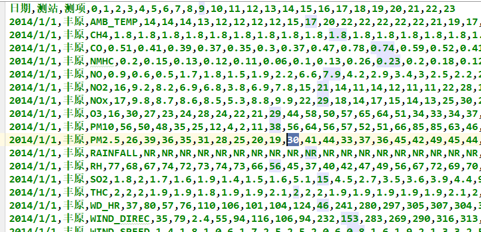
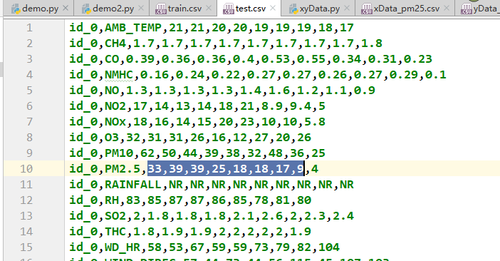
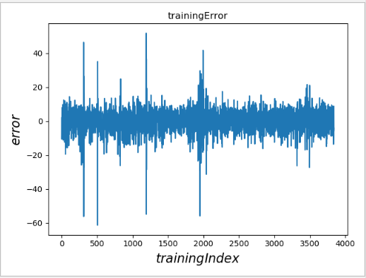
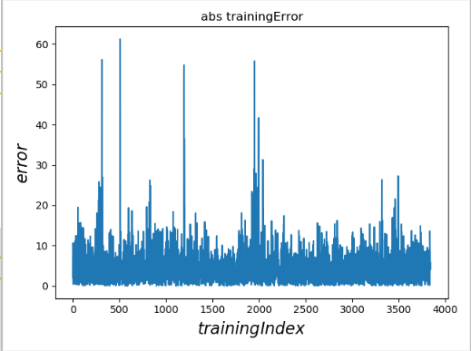
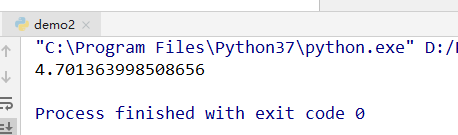
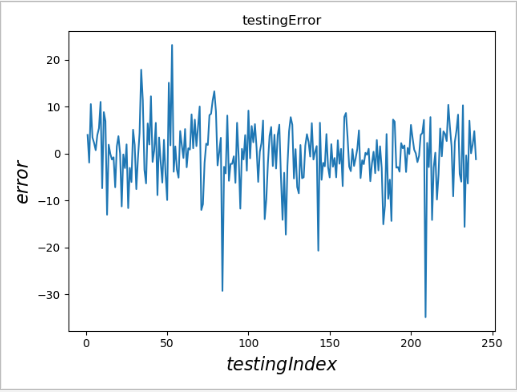
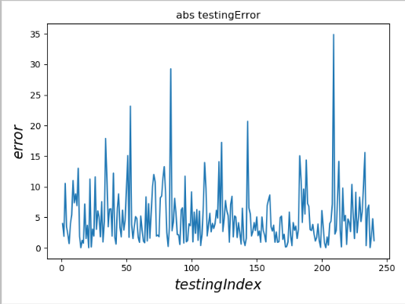
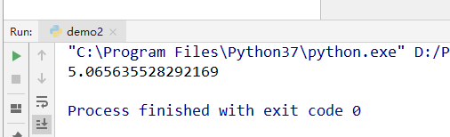

# PM2.5预测（李宏毅机器学习hw1）

通过前8个小时PM2.5的值预测9个小时的PM2.5的值

直到做完我才发现原题是根据前9个小时预测第10个小时的值。不过原理都是一样的。

## 首先，给定的数据有训练集和测试集

训练集数据：

格式：

前三列是时间，测站，所测项目，之后按照序号分别是0时，1时，2时，...，23时的各个项目指标



测试集数据：

格式：9个小时的项目数据



## 数据处理

取前8个小时PM2.5数据放到x_data中，第9个小时的数据放到y_data中。

```python
# 特征值 pm2.5 前8个小时的pm2.5的值
train_x_data = []

# 第9个小时的pm2.5值
train_y_data = []

filename = 'trainingData/train.csv'

with open(filename, encoding='utf-8') as f:
    reader = csv.reader(f)
    ls = list(reader)

    k = 0
    for i in tqdm(range(10, len(ls), 18)):
        k += 1
        # print(str(k) + ' ' + ls[i][2])

        for j in range(3, 19):
            # print(ls[i][j:j+8])
            train_x_data.append(ls[i][j:j+8])
            # print(ls[i][j+8])
            train_y_data.append(ls[i][j+8])


train_x_data = np.array(train_x_data, float)
train_y_data = np.array(train_y_data, float)

np.savetxt("trainingData/xData_pm25.csv", train_x_data, fmt='%.1f', delimiter=",")
np.savetxt("trainingData/yData_pm25.csv", train_y_data, fmt='%.1f', delimiter=",")

# 测试数据处理

testData = 'testingData/'

test_x_data = []
test_y_data = []
with open(testData+'test.csv', encoding="GBK") as f:
    reader = csv.reader(f)
    ls = list(reader)
    k = 0
    for i in tqdm(range(9, len(ls), 18)):
        k += 1
        test_x_data.append(ls[i][2:10])
        test_y_data.append(ls[i][10])

test_x_data = np.array(test_x_data, float)
test_y_data = np.array(test_y_data, float)

print(test_x_data.shape)
print(test_y_data.shape)

np.savetxt(testData+"xData_pm25.csv", test_x_data, fmt='%.1f', delimiter=",")
np.savetxt(testData+"yData_pm25.csv", test_y_data, fmt='%.1f', delimiter=",")

```

## 采用sklearn岭回归拟合

```python
trainingData = 'trainingData/'

x_data = []

y_data = []
# 加载训练数据
np.loadtxt(open(trainingData+'xData.csv'), delimiter=",",skiprows=0)

with open(trainingData+'xData_pm25.csv', encoding='utf-8') as f:
    x_data = np.loadtxt(f, delimiter=",")

with open(trainingData+'yData_pm25.csv') as f:
    y_data = np.loadtxt(f, delimiter=",")
    
    
# 使用广义交叉验证 拟合得到最优alpha参数 = 898.21
# regs = linear_model.RidgeCV(np.linspace(1,1000))
# regs.fit(x_data, y_data)
#
# alpha = regs.alpha_

# 拟合数据
reg = linear_model.Ridge(alpha=898.21)
reg.fit(x_data, y_data)

test_x_data = []

test_y_data = []

testingData = 'testingData/'

# 加载测试集
with open(testingData+'xData_pm25.csv', encoding='utf-8') as f:
    test_x_data = np.loadtxt(f, delimiter=",")

with open(testingData+'yData_pm25.csv') as f:
    test_y_data = np.loadtxt(f, delimiter=",")

pre_y_data = reg.predict(x_data)

# 求得误差
err = abs(pre_y_data - y_data)

plt.plot(np.linspace(1, len(err), len(err)), err)
plt.xlabel(r'$trainingIndex$', fontsize=16)
plt.ylabel(r'$error$', fontsize=16)
plt.title('abs trainingError')
plt.show()

print(err.sum(axis=0)/len(err)*1.0)
```

## 训练集误差



## 训练集误差（经取绝对值）



## 平均误差



## 测试集误差



## 测试集误差（经取绝对值）



## 平均误差



